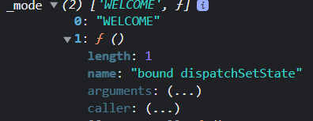

# 📖 목차
* [설치](#설치)
* [폴더설명](#폴더설명)
* [배포](#배포)
* [Component](#component)
   * [props](#props)
   * [event](#event)
   * [state](#state)
* [CRUD](#crud)
   * [Read](#read)
   * [Create](#create)
   * [Update](#update)

---

# 💾 설치
Create React App 설치
```
npx create-react-app my-app
cd my-app
npm start
```

---

# 📂 폴더설명
## src/index.js
* 입구 파일
* `npm start` 명령어를 이용해서 cra를 구동시키면 index.js파일을 찾고 적혀있는대로 동작

## src/App.js
* 화면을 구성하는 UI

---

# 💽 배포
* `npm start`를 이용해서 실행시킨 애플리케이션은 개발을 위한 애플리케이션임
* 개발하기엔 좋지만, 실제로 서비스하기에는 용량도 크고 불필요한 코드들이 있음
  즉, 서비스하기엔 좋지 않음

## 서비스에 최적화, 효율적인 배포본을 만드는 방법 
### build : 배포판을 만드는 과정
* `npm run build`를 입력하면 build 명령어가 시작되고 build라는 폴더가 생성됨
* build 폴더 안에는 index.html파일과 index.html을 의지한 다른파일들이 존재함
  * index.html에는 배포시에 필요없는 공백없이 minimal화 되어 있음
    * 파일 용량을 줄이기 위해
#
* `npx serve -s build` | build폴더안에 있는 index.html파일을 서비스해주는 웹 서버가 실행됨
  * 명령어 실행 시 접속할 수 있는 url이 나옴
  * 개발환경을 위한 버전이 아니라 실제 서비스할 수 있는 버전의 파일이 만들어짐

--- 

# 🧩 Component
React는 사용자 정의 태그를 만드는 기술 (react의 본질)
## 만드는 방법
* 사용자 정의 태그 = **Component (컴포넌트)**
* **함수**로 만들 수 있음
* Component는 반드시 **첫 글자는 대문자** 여야 함

``` jsx
// Header.js
function Header() {
  return (
    <header>
      <h1>
        <a href="/">WEB</a>
      </h1>
    </header>
  );
}

// App.js
function App() {
  return (
    <div>
      <Header />
    </div>
  );
}
```

---

## props
* 컴포넌트 외부에서 사용하는 입력값
* img 태그 등 많은 html태그에는 src, width, height 등 **속성**이 존재
  * `` 
* 컴포넌트에서도 속성이 있는데 react에서는 속성을 **props**라고 부름

### 컴포넌트에서 props를 넘겨주고, 받는 방법
``` jsx
// App.js
function App() {
  const topics = [
    { id: 1, title: 'html', body: 'html is...' },
    { id: 2, title: 'css', body: 'css is...' },
    { id: 3, title: 'javascript', body: 'javascript is...' },
  ]

  return (
    <div>
      <Nav topics={topics}/> // props 넘김
    </div>
  );
}

// Nav.js
function Nav(props) { // props 받음
  const lis = [];
  for (let i = 0; i < props.topics.length; i++) {
    let t = props.topics[i];
    lis.push(
      <li key={t.id}>
        <a href={"/read" + t.id}>{t.title}</a>
      </li>
    );
  }         
  return (
    <nav>
      <ol>{lis}</ol>
    </nav>
  );
}
```
* App.js에서 더미 데이터인 `topics`를 만들고 `Nav` 컴포넌트에 `topics`로 props 전달
* `topics`로 전달 받았기 때문에 `props.topics`로 사용

이 외에 다른 코드
``` jsx
// App.js
<Article title='Welcome' body='Hello, WEB'/>

// Article.js
function Article(props) {
  return (
    <article>
      <h2>{props.title}</h2>
      {props.body}
    </article>
  );
}
```

---

## event
이벤트는 props를 이용

``` jsx
// App.js
<Header
  title="WEB"
  onChangeMode={() => {
    alert("Header");
  }}
/>

// Header.js
function Header(props) {
  return (
    <header>
      <h1>
        <a
          href="/"
          onClick={(e) => {
            e.preventDefault();
            props.onChangeMode();
          }}
        >
          {props.title}
        </a>
      </h1>
    </header>
  );
}

function Header({ onChangeMode }) { // 구조분해 할당으로 받기
  return (
    <header>
      <h1>
        <a
          href="/"
          onClick={(e) => {
            e.preventDefault();
            onChangeMode(); // props 생략 가능
          }}
        >
          {props.title}
        </a>
      </h1>
    </header>
  );
}
```
* App.js에서 `onChangeMode()` 함수를 props로 보냄
  * Header컴포넌트의 a태그를 클릭하면 'Header'라는 메세지가 경고창으로 띄워지는 함수
* props로 받은 함수는 `props.받은 함수명`으로 호출할 수 있음
* `e.preventDefault()` : 브라우저의 기본동작을 비활성화 할 수 있음 (새로고침)
* `({ 여기에 넣어서 })` 구조분해 할당으로 받을 수 있음

---

## state
* `prop`과 함께 컴포넌트 함수를 다시 실행해서 새로운 `return`값을 만들어주는 또하나의 데이터

### 컴포넌트의 입력과 출력
* `prop`을 통해 입력된 데이터를 컴포넌트 함수가 처리해서 `return`값을 만들면,
`return`값이 새로운 UI이가 됨
#
### prop과 state 차이점
* `prop`: 컴포넌트를 사용하는 외부자를 위한 데이터
* `state`: 컴포넌트를 만드는 내부자를 위한 데이터
#
### useState
``` js
const _mode = useState("WELCOME"); // useState의 초기값
const mode =  _mode[0]; // 값을 읽을 수 있음
const setMode = _mode[1]; // 값을 바꿀 수 있음
console.log("_mode", _mode);
```

* 0번째 원소는 상태의 값을 **읽을 때** 쓰는 데이터
* 1번째 원소는 상태의 값을 **변경할 때** 사용하는 함수

위 코드를 더 간결하게 작성
``` jsx
const [mode, setMode] = useState('WELCOME');
```
* `mode`의 값이 `setMode`를 통해 변경되면 `App` 컴포넌트가 다시 실행됨
  * `setMode("READ");`
    * useState가 mode의 값을 `'READ'`로 세팅해줌

#
### state를 변경할 때
#### 원시 데이터 (primitive)
* `const [value, setValue] = useState(PRIMITIVE);`
* string
* number
* boolean
``` js
const [value, setValue] = useState(1); // 원시 데이터
setValue(2); 
```

오리지널 데이터와 새로입력된 데이터가 서로 다른 값이므로 랜더링 됨

#
#### 범 객체
* `const [value, setValue] = useState(Object);`
* object
* array

``` js
const [value, setValue] = useState([1]); // 범객체 데이터
value.push(2); // 오리지널 데이터를 바꾼 것
setValue(value); // 오리지널 데이터를 입력한 것
```
오리지널 데이터와 새로 입력된 데이터를 비교한 결과 값이 같기 때문에 랜더링 되지 않음  
#
##### 값을 바꾸려면?
react는 오리지널 데이터와 새로 입력된 데이터를 비교하고 값이 다르면 랜더링 함

1. 오리지널 데이터를 복제
    * `const = newValue = [...value]`
2. 복제한 데이터를 변경
    * `newValue.push(2)`
3. 변경한 데이터를 set
    * `setValue(newValue)`

---
# 💻 CRUD
## Read
* 작성한 글 목록을 클릭했을 때 작성한 글을 보여주기
* `Article` 컴포넌트에 `props`로 `title, body`를 넘겨줄 때 적절한 값을 보내주면 됨

``` jsx
function App() {
  const [id, setId] = useState(null);

  let content = null;
  if (mode === "WELCOME") {
    // 생략
  } else if (mode === "READ") {
    let title, body = null;
    for (let i = 0; i < topics.length; i++) {
      if (topics[i].id === id) {
        title = topics[i].title;
        body = topics[i].body;
      }
    }
    content = <Article title={title} body={body} />;
  }

  return (
    <div style={{ marginLeft: 10 }}>
      <Nav
        topics={topics}
        onChangeMode={(_id) => {
          setMode("READ");
          setId(_id);
        }}
      />
      {content}
    </div>
  );
}


```
* 어떤 글을 선택했는지 알 수 있게 id state 생성
  * `Nav` 컴포넌트 (글 목록)을 클릭 하면 실행되는 함수에 id state 변경
* id state와 선택한 topics.id가 같은 것만 필터링

#### Nav로 전달한 id props가 문자열
* id가 문자열이라서 컴포넌트가 변경이 안됨
* 입력할 땐 id가 숫자이지만 태그에 속성으로 넘기면 문자열이 됨
  * `<a id={item.id}></a>`
* 문자열 id를 숫자로 컴버팅 해주면 됨
  * `onChangeMode(Number(e.target.id));`

---

## Create
### 로직
1. create 버튼을 클릭하면 글을 생성하는 form이 나옴
2. 글을 입력하고 create 버튼을 누르면 새로운 글이 생성되고, 생성된 글의 상세보기 페이지로 이동

* `<form>` : 어떤 정보를 서버로 전송할 때 사용하는 html 태그
<br />

``` jsx
// Create.js
function Create(props) {
  return (
  <article>
    <h2>Create</h2> 
    <form onSubmit={e => {
      e.preventDefault();
      const title = e.target.title.value;
      const body = e.target.body.value;
      props.onCreate(title, body);
    }}>
      <p><input type="text" name="title" placeholder="제목을 입력하세요."/></p>
      <p><textarea type="text" name="body" placeholder="내용을 입력하세요."/></p>
      <p><input type="submit" value="Create" /></p>
    </form>
  </article>
  );
}

// App.js
function App() {
  const [mode, setMode] = useState("WELCOME");
  const [id, setId] = useState(null);
  const [nextId, setNextId] = useState(4);
  const [topics, setTopics] = useState([
    { id: 1, title: "html", body: "html is..." },
    { id: 2, title: "css", body: "css is..." },
    { id: 3, title: "javascript", body: "javascript is..." },
  ]);

  let content = null;
  if (mode === "WELCOME") {
    // 생략
  } else if (mode === "READ") {
    // 생략
  } else if (mode === "CREATE") {
    content = (
      <Create
        onCreate={(_title, _body) => {
          // topics에 새로운 원소를 추가해서 목록에 추가
          const newTopic = { id: nextId, title: _title, body: _body };
          const newTopics = [...topics];
          newTopics.push(newTopic);
          setTopics(newTopics);

          // 글 작성 후 상세보기 페이지로 넘어가기
          setMode("READ");
          setId(nextId);
          setNextId(nextId + 1); // 다음에 추가할 글을 위해
        }}
      ></Create>
    );
  }
}
```

### App.js
#### [topics 글 목차에 새로운 글 넣기]
* Create 컴포넌트에 `props.함수` 전달 (_title, _body)
* `Create`에서 전달받은 props를 활용해서 새로운 배열을 생성
* 범 객체 state를 변경하기 위해 기존 topics를 복제 후 복제본을 변경
* `setTopics`에 복제본을 넣어서 랜더링
<br />

#### [글 작성 후 상세보기 페이지로 넘어가기]
* 글 작성 후 mode를  `'READ'` mode로 변경
* id 변경 `setId(nextId)`
* 다음에 추가할 글을 위해 `setNextId(nextId + 1)`
<br />

#### Create.js
* form 태그안에 name이 title, body인 태그의 value를 찾기
* `props.함수`에 넣어서 전달하기

---

## Update
create,read를 하이브리드해서 구현
  * 하이브리드: 특정한 목표를 달성하기 위해 두 개 이상의 요소가 합친 것
### 1. update로 가는 링크 추가
* a태그를 ul태그로 감싸서 목록화
``` jsx
function App() {
  return (
    <ul>
      <li>
        <a href="/create"> /* Create 생략 */ </a>
      </li>
      <li>
        <a href="/update">Update</a>
      </li>
    </ul>
  )
}
```

<br />

### 2. 'READ'모드일 때만 Update 링크가 나오게 하기
홈에서는 없고 글 목록을 클릭할 때만 보임
1. contextControl 지역변수 생성 (맥락적으로 노출되는 UI라는 뜻)
    * `contextControl = <li><a href="/update">Update</a></li>`
2. Update의 고유한 id를 주소에 추가 (형식 지킬려고)
3. `onClick` 이벤트 
    * update mode로 변경
``` jsx
// App.js
let contextControl = null;
else if (mode === "READ") {
  // 생략
  contextControl = (
    <li>
      <a
        href={"/update" + id} 
        onClick={(e) => {
          e.preventDefault();
          setMode("UPDATE");
        }}
      >
        Update
      </a>
    </li>
  );
} 
```
<br />

### 3. 기존에 작성한 title, body 가져와서 변경하고 App으로 전달하기
> * 수정 기능을 만들기 위해선 Update 버튼을 클릭했을 때 사용자가 작성한 내용을 불러와야 함
>* `Update` 컴포넌트가 `title, body`의 props를 기본적으로 가지고 있어야 함

``` jsx
// App.js
let content = null;
let contextControl = null;
if (mode === "WELCOME") {
  // 생략
} else if (mode === "READ") {
  // 생략
} else if (mode === "CREATE") {
  // 생략
} else if (mode === "UPDATE") {
  let title,
    body = null;
  for (let i = 0; i < topics.length; i++) {
    if (topics[i].id === id) {
      title = topics[i].title;
      body = topics[i].body;
    }
  }
  content = (
    <Update 
      title={title} // props 전달
      body={body} 
      onUpdate={(title, body) => {}} // 전달받은 데이터 인자로 받기
    ></Update>
  );
}


// Update.js
function Update(props) { // props 받음
  // props를 state로 변경
  const [title, setTitle] = useState(props.title);
  const [body, setBody] = useState(props.body);

  return (
    <article>
      <h2>Update</h2>
      <form
        onSubmit={(e) => {
          e.preventDefault();
          const title = e.target.title.value; // 입력값
          const body = e.target.body.value;
          props.onUpdate(title, body); // 전달
        }}
      >
        <p>
          <input
            type="text"
            name="title"
            placeholder="제목을 입력하세요."
            value={title}
            onChange={(e) => {
              setTitle(e.target.value); // state 변경
            }}
          />
        </p>
        <p>
          // body 생략
        </p>
      </form>
    </article>
  )
}
```

1. title, body를 구해서 `Update` 컴포넌트에 props로 전달
    * `Update` 컴포넌트에서 props 받기
<br/>

2. **전달 받은 props를 state로 변경**
    * `props`는 **외부자**가 사용하는 명령이기 때문에 내부에선 변경하지 못함
      * 내부에서 변경할 수 있는 `state`로 변경
<br/>

3. **onChange event 생성** 
    * 사용자의 입력값을 구해서 state를 변경
    * `e.target.value`로 입력값을 구하고 setState로 최종적으로 바꿈
      * `setTitle(e.target.value);`
<br/>

4. 변경한 `state(title, body)`를 `onUpdate` 함수로 전달
<br/>


### 4. 변경된 값으로 topics 변경
``` jsx
// App.js Update mode
else if (mode === "UPDATE") {
  // title, body 구하기
  let title,
    body = null;
  for (let i = 0; i < topics.length; i++) {
    if (topics[i].id === id) {
      title = topics[i].title;
      body = topics[i].body;
    }
  }

  content = (
    <Update 
      title={title} 
      body={body} 
      onUpdate={(title, body) => {
        const newTopics = [...topics]; // 복제본
        const updatedTopic = { id: id, title: title, body: body }; 
        for (let i = 0; i < newTopics.length; i++) {
          if (newTopics[i].id === id) { // 선택한 topic
            newTopics[i] = updatedTopic; // 선택한 topic을 updatedTopic로 바꿈
            break; // 반복문 종료
          }
        }
        setTopics(newTopics); 
        setMode("READ");
      }}
    ></Update>
  );
}
```

1. `topics`  복제본 `newTopics` 생성
2. `updatedTopic`에 변경된 데이터 넣기
3. `setTopics`에 `newTopics`에 넣어서 복제본 변경
4. 수정 후 상세보기 페이지로 넘어가기

#

[🔼 목차로 돌아가기 ](#목차)